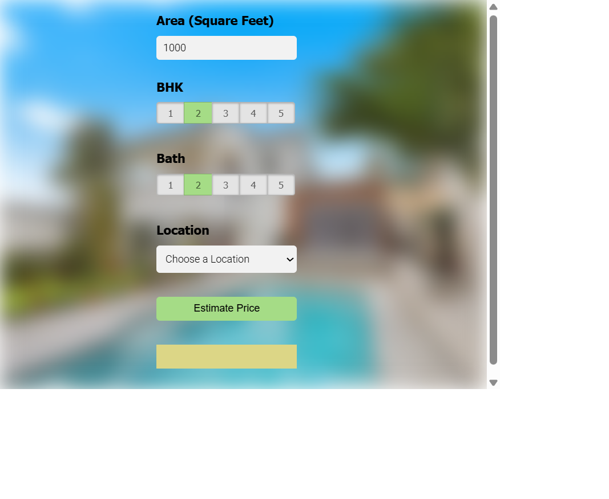

<<<<<<< HEAD
# 🏡 Bangalore House Price Prediction

A full-stack machine learning web application that predicts Bangalore house prices based on location, square footage, BHK, and bathrooms — built with Python, Scikit-learn, Flask, HTML, CSS, JavaScript, and jQuery.

---

## Features

📍 Dynamic location dropdown loaded from backend  
📐 Square footage based prediction  
🛏️ BHK selection support  
🛁 Bathroom count support  
🤖 Machine learning powered price prediction  
⚡ Fast Flask REST API backend  
🌐 Interactive frontend UI  
📦 Serialized trained ML model using Pickle  
📂 JSON-based metadata loading for locations  

---

## Tech Stack

| Layer | Tech |
|------|------|
| Machine Learning | Python, NumPy, Pandas, Scikit-learn |
| Visualization | Matplotlib |
| Backend | Flask |
| Frontend | HTML, CSS, JavaScript, jQuery |
| API Testing | Postman |
| Model Storage | Pickle |
| Metadata Storage | JSON |

---

## Project Structure

```bash
blrhouseprediction/
├── client/
│   ├── app.html              # Frontend UI
│   ├── app.css               # Styling
│   └── app.js                # Frontend logic + API calls
│
├── server/
│   ├── server.py             # Flask backend
│   ├── util.py               # Model loading + prediction logic
│   └── artifacts/
│       ├── columns.json      # Feature metadata
│       └── bangalore_home_prices_model_pickle
│
├── Bengaluru_House_Data.csv  # Dataset
├── model.ipynb               # Training notebook
└── README.md
```

---

## Getting Started

### 1. Clone the repository

```bash
git clone https://github.com/your-username/bangalore-house-price-prediction.git
cd bangalore-house-price-prediction
```

---

### 2. Create virtual environment

```bash
python -m venv venv
```

Activate:

**Windows**
```bash
venv\Scripts\activate
```

**Mac/Linux**
```bash
source venv/bin/activate
```

---

### 3. Install dependencies

```bash
pip install flask numpy pandas scikit-learn matplotlib jupyter
```

---

### 4. Start backend server

```bash
cd server
python server.py
```

Server runs on:

```bash
http://127.0.0.1:5000
```

---

### 5. Start frontend

Open:

```bash
client/app.html
```

using **Live Server** (VS Code recommended)

Frontend runs on:

```bash
http://127.0.0.1:5500
```

---

## How It Works

### Machine Learning Pipeline

The model pipeline includes:

- Data cleaning
- Missing value handling
- Outlier removal
- Feature engineering
- Location dimensionality reduction
- One-hot encoding
- Train/test split
- Model evaluation using GridSearchCV
- Final Linear Regression model training
- Model export using Pickle

---

### Backend API

Flask loads:

- trained ML model
- feature columns
- location metadata

Endpoints:

#### GET `/get_location_names`

Returns all available Bangalore locations.
=======
# Bangalore House Price Prediction

A small web app for predicting Bangalore house prices using a trained machine learning model. The frontend is a static HTML/CSS/JavaScript page in `client/`, while the backend is a Flask API in `server/` that loads a saved model and returns predictions.

## Project Structure

- `client/`
  - `app.html` - frontend user interface for entering area, BHK, bathroom count, and location.
  - `app.js` - JavaScript logic that loads location names and calls the Flask prediction API.
  - `app.css` - styles for the prediction form.
- `server/`
  - `server.py` - Flask server with endpoints to get locations and predict prices.
  - `util.py` - loads saved model artifacts and computes price estimates.
  - `artifacts/`
    - `bangalore_home_prices_model_pickle` - trained ML model used for predictions.
    - `columns.json` - feature column order used by the model.
- `Bengaluru_House_Data.csv` - dataset used for model training and exploration.
- `ml.ipynb` - notebook for data cleaning, feature engineering, model training, and evaluation.
- `client-screenshot.png` - screenshot of the app UI.

## Screenshot



## How to Run Locally

1. Open a terminal in the project folder.
2. Activate your Python environment. For example:

```powershell
cd "c:\Users\Administrator\Desktop\Projects and stuff\blrhouseprediction"
venv\Scripts\Activate.ps1
```

3. Install the required Python packages:

```powershell
pip install -r requirements.txt
```

4. Start the Flask server:

```powershell
python server\server.py
```

5. Open `client\app.html` in your browser.

6. Use the form to enter:
   - Area in square feet
   - BHK value
   - Bathroom count
   - Location

7. Click **Estimate Price**.

## API Endpoints

- `GET /get_location_names` - returns a JSON array of supported Bangalore locations.
- `POST /predict_home_price` - accepts form data (`total_sqft`, `bhk`, `bath`, `location`) and returns an estimated price.
>>>>>>> daa9a0c (updated readme)

Example response:

```json
{
<<<<<<< HEAD
  "locations": [
    "1st phase jp nagar",
    "electronic city",
    "rajaji nagar"
  ]
}
```

---

#### POST `/predict_home_price`

Predicts house price.

Request body:

```json
{
  "total_sqft": 1000,
  "location": "1st phase jp nagar",
  "bhk": 2,
  "bath": 2
}
```

Response:

```json
{
  "estimated_price": 83.87
}
```

---

### Frontend Flow

User:

- enters square footage
- selects BHK
- selects bathrooms
- chooses location
- clicks **Estimate Price**

Frontend sends AJAX request to Flask backend.

Backend:

- preprocesses input
- creates feature vector
- runs prediction
- returns estimated price

Frontend displays:

```bash
₹83.87 Lakhs
```

---

## API Testing

Backend endpoints were tested using Postman.

Example tested routes:

```bash
GET  http://127.0.0.1:5000/get_location_names
POST http://127.0.0.1:5000/predict_home_price
```

---

## Challenges Faced

During development:

- Jupyter kernel setup issues
- Python virtual environment configuration
- Flask dependency/import issues
- Scikit-learn version compatibility changes
- Route debugging
- Form-data request formatting in Postman
- Frontend/backend port mismatch
- Model artifact loading bugs
- Dynamic dropdown integration

---

## Future Improvements

🚀 Deploy to Render / Railway / AWS  
📱 Fully responsive mobile UI  
📈 Better regression models (XGBoost / Random Forest)  
🗺️ Map-based location picker  
📊 Price trend visualizations  
🧠 Smarter feature engineering  
☁️ Public API deployment  

---

## Learning Outcomes

This project helped strengthen understanding of:

- end-to-end ML workflows
- regression modeling
- feature engineering
- Flask API development
- frontend-backend integration
- AJAX requests
- debugging deployment issues
- serving trained machine learning models

---
=======
  "estimated_price": 82.72
}
```

## Model and Efficiency

- The prediction backend uses a pre-trained model loaded once at startup from `server/artifacts/bangalore_home_prices_model_pickle`.
- Location names are loaded from `server/artifacts/columns.json` and served directly to the frontend.
- Prediction requests are efficient because they only require a small feature vector and a single model inference.
- The app is designed for fast local use, with no database or server-side training during runtime.

## Notes and Improvements

- The app currently uses `jQuery` in the frontend and static HTML, which is simple and easy to maintain.
- To improve efficiency further:
  - host the backend with `gunicorn` or another production server instead of Flask's built-in server;
  - validate frontend input before sending requests;
  - add error handling for invalid or missing values;
  - extend the model with more features or additional preprocessing.

## Dependencies

- Flask
- numpy
- scikit-learn
- pandas (for the notebook)
- matplotlib (for the notebook)

## Notes

- The notebook `ml.ipynb` contains the data cleaning and model-building workflow for Bangalore housing data.
- Model accuracy and deployment can be improved by adding cross-validation, better feature handling, and more location data.
>>>>>>> daa9a0c (updated readme)
